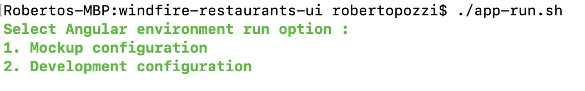
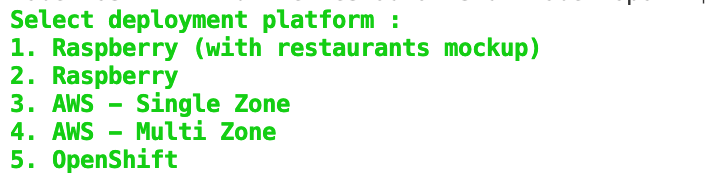

# Windfire Restaurants UI
This repository holds the code for UI of my *Windfire Restaurants* management application, along with scripts, playbooks and configurations to automate application run and deployment to target infrastructures.

## Before you start
The *Windfire Restaurants UI* microservice of the application is developed using Angular technology; to test it locally, you need to install Angular on your workstation, follow the instructions at Angular website (*https://angular.io/guide/setup-local*) to setup Angular and all its prerequisites.

Before starting to use and test the application you also need to ensure all the dependencies for the application are installed, I provided *app-init.sh* script for your convenience, just run it and it will do it for you.

## Run the application on local
The application uses Angular environment customization mechanism to run with different configurations, defined as files (with *.ts* extension) available in *src/environments* folder.

Script *app-run.sh* is provided to start the application, letting choose which environment configuration is to be applied; currently the script exposes 2 options:

As it can be seen in the figure above, options are the following:
* *Mockup configuration* uses environment configuration defined in *src/environment/environment.mockup.ts*, which basically mocks the Restaurant Service, returning a fixed restaurant list. No other microservice is actually invoked;
* *Default configuration* uses standard environment configuration, pointing to *Windfire Restaurant Backend* microservice endpoint, to which restaurant list retrieval is delegated; the endpoint is read from RESTAURANT_SRV_BASEURL environment variable or, if not found, alternatively from *src/environment/environment.ts* configuration file.

## DevOps automation
Automation is implemented using Ansible technology (https://www.ansible.com/): refer to Ansible technical documentation (https://docs.ansible.com/) for detailed instructions regarding installation and setup.

The *deploy.sh* script is provided to run deployment automation tasks. 

As it can be seen in the figure above, the script currently exposes 4 deployment options:
* *Raspberry (with restaurants mockup)* : it automates *Windfire Restaurants UI* microservice deployment to a Raspberry Pi, enabling the *Mockup configuration* (as defined in *src/environment/environment.mockup.ts*)
* *Raspberry* : it automates *Windfire Restaurants UI* microservice deployment to a Raspberry Pi, enabling the *Default configuration* (as defined in *src/environment/environment.ts*)
* *AWS (with restaurants mockup)* : it automates *Windfire Restaurants UI* microservice deployment to AWS, enabling the *Mockup configuration* (as defined in *src/environment/environment.mockup.ts*)
* *AWS* : it automates *Windfire Restaurants UI* microservice deployment to AWS, enabling the *Default configuration* (as defined in *src/environment/environment.mockup.ts*)

### Raspberry deployment architecture
Both Raspberry options assume Apache2 as web server target for deployment and are based on the following High level architecture:

You can refer to my article *https://bit.ly/3b13V9h* on Medium and to my other GitHub repository *https://github.com/robipozzi/windfire-raspberry.git* for instructions and code to setup Apache2 on Raspberry Pi.

A file, named *ansible.cfg*, is provided to set basic configurations needed to run Ansible: the *deploy.sh* script sets ANSIBLE_CONFIG environment variable pointing to this file; the basic configuration you should have is something like this:

where:

* *private_key_file* points to the SSH private key used by Ansible to connect and launch tasks on the target infrastructure;
* *inventory* defines where Ansible will look for the inventory file, which is used by Ansible to know which servers to connect and manage.

Change the parameters according to your environment.

The script wraps Ansible to automate deployment tasks, using the Ansible playbook .

### AWS architecture
AWS target deployment environment is based on the following Architecture

Windfire Restaurant UI microservice is deployed to an EC2 instance running Apache HTTP Server, placed in the Frontend subnet. 

For security reasons, either the Frontend and Backend subnets are not directly accessible via SSH. Ansible automation script is configured to connect to the target hosts via a Bastion Host, conveniently placed in the Management subnet.

## References
I wrote some more extensive articles on how to install and configure software on Raspberry Pi, which can be useful:
* Use Ansible to automate infrastructure installation, configuration and application deployment on Raspberry Pi : *https://bit.ly/3b13V9h*;
* Install Apache2 on Raspberry Pi : https://bit.ly/2xvuIf4
* Secure Raspberry Pi with self signed SSL certificates : https://bit.ly/3b8ujhs