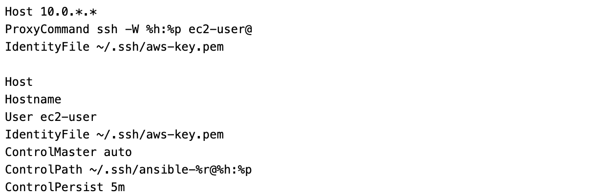

# Windfire Restaurants UI
- [Overview](#overview)
- [Before you start](#before-you-start)
- [Run microservice on local](#run-the-application-on-local)
- [DevOps automation](#devops-automation)
  - [Raspberry deployment architecture](#raspberry-deployment-architecture)
  - [AWS architecture](#aws-architecture)
    - [How deployment automation procedure works](#how-deployment-automation-procedure-works)
    - [Ansible dynamic configuration](#ansible-dynamic-configuration)
    - [Angular dynamic configuration](#angular-dynamic-configuration)
  - [OpenShift architecture](#openshift-architecture)
    - [Jenkins pipeline](#jenkins-pipeline)
- [References](#references)

## Overview
This repository holds the code for UI of my *Windfire Restaurants* management application, along with scripts, playbooks and configurations to automate application run and deployment to target infrastructures.

## Before you start
The *Windfire Restaurants UI* microservice of the application is developed using Angular technology; to test it locally, you need to install Angular on your workstation, follow the instructions at Angular website (*https://angular.io/guide/setup-local*) to setup Angular and all its prerequisites.

Before starting to use and test the application you also need to ensure all the dependencies for the application are installed, I provided **app-init.sh** script for your convenience, just run it and it will do it for you.

## Run the application on local
The application uses Angular environment customization mechanism to run with different configurations, defined as files (with *.ts* extension) available in *src/environments* folder.

Script **app-run.sh** is provided to start the application, letting choose which environment configuration is to be applied; currently the script exposes 2 options, as it can be seen in the figure below:

Options are the following:
* *Mockup configuration* uses environment configuration defined in *src/environment/environment.mockup.ts*, which basically mocks the Restaurant Service, returning a fixed restaurant list. No other microservice is actually invoked;
* *Development configuration* uses standard environment configuration, pointing to *Windfire Restaurant Backend* microservice endpoint, to which restaurant list retrieval is delegated; the endpoint is read from *src/environment/environment.ts* configuration file.

## DevOps automation
Automation is implemented using Ansible technology (https://www.ansible.com/): refer to Ansible technical documentation (https://docs.ansible.com/) for detailed instructions regarding installation and setup.

The **deploy.sh** script is provided to run deployment automation tasks, as it can be seen in the figure below. 

The script currently exposes 4 deployment options:
* *Raspberry (with restaurants mockup)* : it automates *Windfire Restaurants UI* microservice deployment to a Raspberry Pi, enabling the *Mockup configuration* (as defined in *src/environment/environment.mockup.ts*)
* *Raspberry* : it automates *Windfire Restaurants UI* microservice deployment to a Raspberry Pi; configuration parameters are read from *config-raspberry.json* file, placed in *src/assets/config* subfolder
* *AWS - Single Zone* : it automates *Windfire Restaurants UI* microservice deployment to an AWS architecture with 1 publicly accessible Frontend and 1 publicly accessible Backend subnet in a single availability zone
* *AWS - Multi Zone* : it automates *Windfire Restaurants UI* microservice deployment to an AWS architecture with Frontend and Backend subnets in a variable number of availability zones to create a Fault Tolerant architecture
* *OpenShift* : it automates *Windfire Restaurants UI* microservice deployment to an OpenShift cluster

### Raspberry deployment architecture
Both Raspberry options assume Apache2 as web server target for deployment and are based on the following High level architecture:

You can refer to my article *https://bit.ly/3b13V9h* on Medium and to my other GitHub repository *https://github.com/robipozzi/windfire-raspberry.git* for instructions and code to setup Apache2 on Raspberry Pi.

A file, named **ansible.cfg**, is provided to set basic configurations needed to run Ansible: the **deploy.sh** script sets ANSIBLE_CONFIG environment variable pointing to this file; the basic configuration you should have is something like this:

where:

* *inventory* defines where Ansible will look for the inventory file, which is used by Ansible to know which servers to connect and manage;
* *private_key_file* points to the SSH private key used by Ansible to connect and launch tasks on the target infrastructure.

Change the parameters according to your environment.

The script wraps Ansible to automate deployment tasks, using the Ansible provided playbook [deployment/raspberry/deploy.yaml](deployment/raspberry/deploy.yaml).

### AWS architecture
AWS target deployment environment is based on the following Architecture

Windfire Restaurant UI microservice is deployed to an EC2 instance running Apache HTTP Server, placed in the Frontend subnet. 

For security reasons, either the Frontend and Backend subnets are not directly accessible via SSH. Ansible automation script is configured to connect to the target hosts via a Bastion Host, conveniently placed in the Management subnet.

#### How deployment automation procedure works
In case of deployment to AWS, the **deploy.sh** script needs to account for the dynamic nature of Cloud architecture; it wraps Ansible to automate deployment tasks, passing [windfire.aws_ec2.yaml](deployment/aws/windfire.aws_ec2.yaml) file as a parameter, which instructs Ansible to get Host IPs from a dynamic inventory, when invoking the Ansible provided playbook [deployment/aws/deploy.yaml](deployment/aws/deploy.yaml).

The **deploy.sh** script uses 2 other scripts to generate configurations on the fly, based on the dynamic values of the provisioned AWS architecture:
* it delegates the dynamic definition of the configurations needed by Ansible to [deployment/aws/ansible-config.sh](deployment/aws/ansible-config.sh) script 
* it delegates the dynamic creation of **src/assets/config/config-aws.json** configuration file, used by Angular application to externalize configuration parameters, to [deployment/aws/appconfig-generator.sh](deployment/aws/appconfig-generator.sh) script

#### *Ansible dynamic configuration*
The [deployment/aws/ansible-config.sh](deployment/aws/ansible-config.sh) script dynamically defines the following 2 files that are used by Ansible:
* **ansible-aws.cfg**, which dynamically sets Ansible configuration. An example of such a configuration is reported in the following figure

As it can be seen, the **[inventory]** section of the Ansible configuration file does not refer to any specific host inventory but just enable plugins to dynamically get the information about hosts from AWS ([Inventory Plugins](https://docs.ansible.com/ansible/latest/plugins/inventory.html#inventory-plugins) is a standard mechanism provided by Ansible to dynamically build host inventories). 

* **ansible-ssh.cfg**, which sets SSH configurations to allow Ansible to connect to Frontend and Backend instances, through the Bastion Host. An example of such a configuration is reported in the following figure

#### *Angular dynamic configuration*
The [deployment/aws/appconfig-generator.sh](deployment/aws/appconfig-generator.sh) script creates **src/assets/config/config-aws.json** on the fly, with key-value configuration items based on AWS dynamic infrastructure values, as in the example below

### OpenShift architecture
In case of deployment to OpenShift, **deploy.sh** delegates to [deployment/openshift/deploy.sh](deployment/openshift/deploy.sh) script, which then runs an **oc new-app** command using [deployment/openshift/windfire-restaurants-backend-template.yaml](deployment/openshift/windfire-restaurants-backend-template.yaml) OpenShift Template; the template defines and creates all the following objects:

* *ImageStream* that references the container image in OpenShift Internal Registry
* *BuildConfig* of type Git that uses *nodejs:10-SCL* Source-to-Build image to build from source code
* *DeploymentConfig* that defines how the application is deployed to OpenShift cluster
* *Service* of type ClusterIP that exposes required ports and allows to interact with the running pods from within the OpenShift cluster
* *Route* that exposes the Service outside the OpenShift cluster

#### Jenkins pipeline
A BuildConfig definition of type JenkinsPipeline is also available at [deployment/openshift/buildconfig.yaml](deployment/openshift/buildconfig.yaml) to allow using Jenkins to automate build and deployment to OpenShift; the BuildConfig then delegates the build and deployment steps to [Jenkinsfile](Jenkinsfile)

[TODO]

## References
I wrote some more extensive articles on how to install and configure software on Raspberry Pi, which can be useful:
* Use Ansible to automate infrastructure installation, configuration and application deployment on Raspberry Pi : *https://bit.ly/3b13V9h*;
* Install Apache2 on Raspberry Pi : https://bit.ly/2xvuIf4
* Secure Raspberry Pi with self signed SSL certificates : https://bit.ly/3b8ujhs